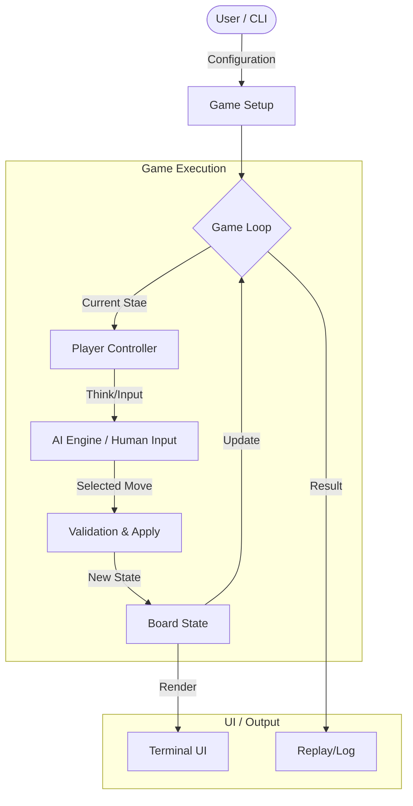

# System Architecture

## Overview

Shogi-Aho-AI is a Rust-based game engine capable of running Shogi, Chess, and mixed variants (e.g., Shogi vs Chess). It features a modular architecture separating core game logic, UI, and AI implementations.

## Directory Structure

| Module         | Description                                                                                                                                         |
| -------------- | --------------------------------------------------------------------------------------------------------------------------------------------------- |
| `src/core`     | **Domain Layer**: Defines fundamental types (`Board`, `Piece`, `Move`), rules, and game state. Pure data structures and basic manipulation methods. |
| `src/logic`    | **Game Logic**: Implements rule enforcement, move generation, checkmate detection, and state transition logic (`apply_move`).                       |
| `src/game`     | **Game Usage**: Manages the game loop, time control, replay, and game modes (`Game` struct, `History`).                                             |
| `src/player`   | **Player Interface**: Traits for player interaction (`PlayerController`) and implementations (AI, TUI/Human).                                       |
| `src/ui`       | **User Interface**: Handles input/output, rendering (TUI), and interactive menus.                                                                   |
| `src/selfplay` | **Tooling**: Utilities for running automated self-play matches for AI tuning and testing.                                                           |

## Core Concepts

### Board Representation

- **HashMap-based**: `Board` uses `HashMap<Position, Piece>` for sparse piece storage. This supports arbitrary board sizes and non-rectangular shapes if needed, though performance is traded for flexibility compared to Bitboards.
- **Mixed Protocols**: The engine supports `PlayerConfig` to define different rules (Movement, Promotion Zones) for each player, enabling asymmetric games (e.g., Shogi vs Chess).

### AI Pipeline (`src/player/ai`)

The AI uses a standard **Iterative Deepening Negamax** framework with Alpha-Beta pruning.

1.  **Search (`alpha_beta.rs`)**:

    - Iterative Deepening (ID)
    - Transposition Table (TT) for caching positions.
    - Principal Variation Search (PVS) [Planned/Partial].
    - Move Ordering (Captures > Promotions > Quiet).

2.  **Evaluation (`eval.rs`)**:
    - **Material**: Sum of piece values (optimized for mixed variants).
    - **PST**: Piece-Square Tables for positional judgment.
    - **Hand Bonus**: Dynamic scoring for captured pieces to encourage drops.

## Data Flow Diagram (Game Loop)

## Key Flows

### 1. Move Generation (`logic/mod.rs`)

- `legal_moves(board, player)` generates all pseudo-legal moves.
- Filters out moves that leave the King in check (`is_move_safe`).
- Handles special drops and promotions based on `PieceKind` and `PlayerConfig`.

### 2. Self-Play System (`selfplay/mod.rs`)

- Multi-threaded execution using `Rayon`.
- Simulates thousands of games to gather statistical data on win rates and game length.
- Outputs JSON results for Python analysis scripts.
