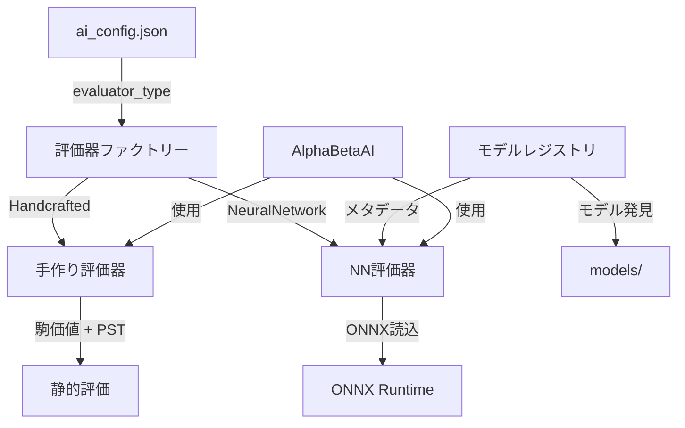
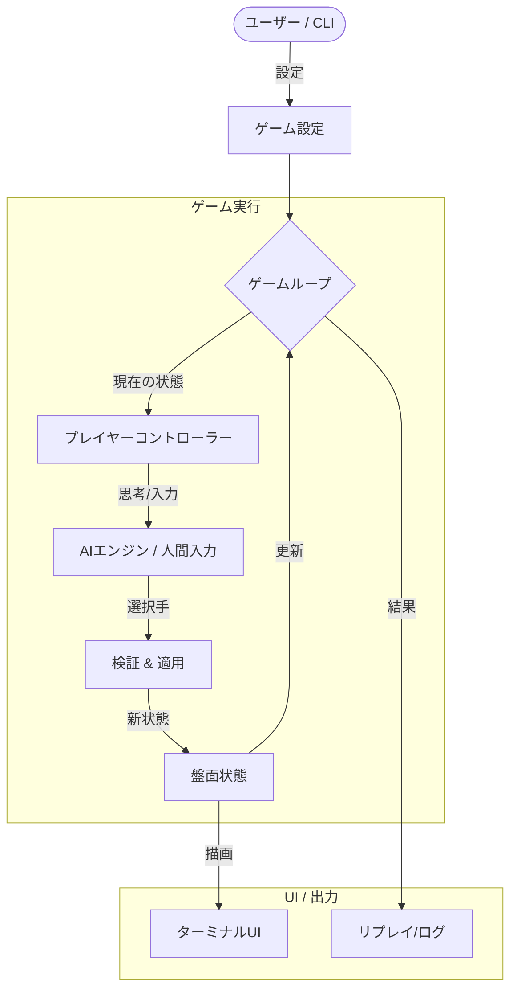

# システムアーキテクチャ

## 概要

Shogi-Aho-AI は、将棋、チェス、混合バリアント（例：将棋 vs チェス）を実行できる Rust ベースのゲームエンジンです。コアゲームロジック、UI、AI 実装を分離したモジュラーアーキテクチャを特徴とし、複数の ML 評価モデルをサポートします。

## ディレクトリ構造

| モジュール     | 説明                                                                                                               |
| -------------- | ------------------------------------------------------------------------------------------------------------------ |
| `src/core`     | **ドメイン層**: 基本型（`Board`、`Piece`、`Move`）、ルール、ゲーム状態を定義。純粋なデータ構造と基本操作メソッド。 |
| `src/logic`    | **ゲームロジック**: ルール適用、手生成、詰み検出、状態遷移ロジック（`apply_move`）を実装。                         |
| `src/game`     | **ゲーム使用**: ゲームループ、時間制御、リプレイ、ゲームモード（`Game` 構造体、`History`）を管理。                 |
| `src/player`   | **プレイヤーインターフェース**: プレイヤー操作のトレイト（`PlayerController`）と実装（AI、TUI/人間）。             |
| `src/ui`       | **ユーザーインターフェース**: 入出力、レンダリング（TUI）、インタラクティブメニューを処理。                        |
| `src/selfplay` | **ツール**: AI チューニングとテストのための自動 Self-Play マッチ実行ユーティリティ。                               |
| `src/ml`       | **機械学習**: ML モデルレジストリ、特徴抽出、ニューラルネットワーク評価器（`ml` フィーチャーが必要）。             |

## コア概念

### 盤面表現

- **HashMap ベース**: `Board` は `HashMap<Position, Piece>` を使用してまばらな駒の保存。これにより任意の盤面サイズと非矩形形状をサポート（必要に応じて）。Bitboard と比較して柔軟性のためにパフォーマンスをトレードオフ。
- **混合プロトコル**: エンジンは `PlayerConfig` をサポートし、各プレイヤーに異なるルール（移動、昇格ゾーン）を定義可能。これにより非対称ゲーム（例：将棋 vs チェス）が可能。

### AI パイプライン (`src/player/ai`)

AI は標準的な **反復深化 Negamax** フレームワークと Alpha-Beta 枝刈りを使用。

1.  **探索 (`alpha_beta.rs`)**:

    - 反復深化(ID)
    - 置換表(TT) - 局面キャッシュ用
    - 主要変化探索(PVS)
    - 後期手削減(LMR)
    - ヌルムーブ枝刈り(NMP)
    - 手順付け (Killers > キャプチャ > 昇格 > 静手)

2.  **評価 (プラグ可能な評価器)**:

    - **手作り評価器** (`eval.rs`):

      - 駒の価値: 駒の価値の合計（混合バリアント用に最適化）
      - PST: 位置判断用の駒-マス表
      - 持駒ボーナス: 駒打ちを促すためのキャプチャ駒の動的スコア

    - **ニューラルネットワーク評価器** (`ml/nn_evaluator.rs`, `--features ml` が必要):
      - ONNX Runtime 推論
      - 盤面特徴抽出
      - `models/` ディレクトリからのモデル読み込み

3.  **設定 (`config.rs`)**:
    - JSON ベース設定 (`ai_config.json`)
    - `evaluator_type` フィールドによる動的評価器選択
    - 複数モデルパスサポート

### マルチモデルアーキテクチャ

システムは柔軟な評価器アーキテクチャを通じて複数の ML モデルをサポート:

**主要コンポーネント:**

- **`Evaluator` トレイト**: 全評価戦略の共通インターフェース
- **`ModelRegistry`**: 利用可能な ML モデルの管理と追跡
- **動的ロード**: 設定に基づいて実行時に評価器を選択
- **フィーチャーフラグ**: ML サポートは `--features ml` でゲート、オプション依存

## データフロー図 (ゲームループ)

## 主要フロー

### 1. 手生成 (`logic/mod.rs`)

- `legal_moves(board, player)` は全ての擬似合法手を生成。
- 王を取られる手を除外 (`is_move_safe`)。
- `PieceKind` と `PlayerConfig` に基づいて特殊な駒打ちと昇格を処理。

### 2. Self-Play システム (`selfplay/mod.rs`)

- `Rayon` を使用したマルチスレッド実行。
- 勝率とゲーム長の統計データを収集するため数千ゲームをシミュレート。
- Python 分析スクリプト用に JSON 結果を出力。

### 3. ML 訓練パイプライン

1. Self-Play で訓練データ生成（棋譜 JSON ファイル生成）
2. `extract_features` バイナリで特徴抽出
3. Python スクリプト（`scripts/ml/train.py`）でモデル訓練
4. Rust 推論用に ONNX 形式にエクスポート
5. `ai_config.json` 経由で訓練済みモデルを使用するよう AI を設定
